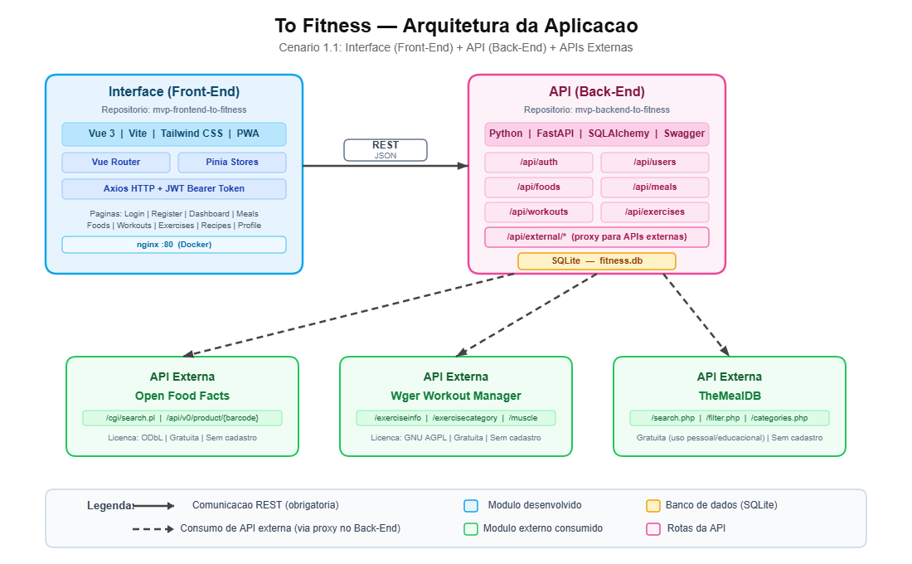

# To Fitness — Interface

Interface web desenvolvida em **Vue 3 + Vite** para o sistema **To Fitness** — plataforma de controle de treinos, refeições e metas de saúde pessoal.

---

## Arquitetura da aplicação



**Cenário adotado:** Cenário 1 — Interface (Front-End) que consome uma API principal (Back-End) que, por sua vez, consulta serviços externos.

---

## Funcionalidades

- Cadastro e login de usuários com autenticação JWT
- Onboarding com cálculo automático de metas nutricionais (IMC, TMB, TDEE)
- Dashboard com resumo diário de calorias, macros e treinos
- Biblioteca de exercícios com busca, filtros por grupo muscular e paginação
- Busca de alimentos via Open Food Facts (código de barras e nome)
- Diário alimentar com refeições e controle de macros
- Treinos personalizados com histórico
- Receitas saudáveis via TheMealDB
- PWA (Progressive Web App) — instalável em dispositivos móveis
- Layout responsivo (mobile e desktop)

---

## Tecnologias

| Item | Tecnologia |
|------|-----------|
| Framework | Vue 3 (Composition API) |
| Build | Vite 5 |
| Roteamento | Vue Router 4 |
| Estado global | Pinia |
| HTTP Client | Axios |
| Estilização | Tailwind CSS |
| Ícones | Heroicons |
| PWA | vite-plugin-pwa |
| Container | Docker + Nginx |

---

## Pré-requisitos

- Node.js 20+
- npm
- API backend rodando em `http://localhost:8000` ([repositório do backend](https://github.com/grazibehr/mvp-backend-to-fitness))

---

## Instalação e execução local

```bash
# 1. Clone o repositório
git clone https://github.com/grazibehr/mvp-frontend-to-fitness.git
cd mvp-frontend-to-fitness

# 2. Instale as dependências
npm install

# 3. Configure as variáveis de ambiente
cp .env.example .env
# Edite o .env se necessário (padrão aponta para localhost:8000)

# 4. Inicie o servidor de desenvolvimento
npm run dev
```

A interface estará disponível em: http://localhost:5173

---

## Execução com Docker Compose (recomendado)

Sobe o front-end e o back-end juntos com um único comando. O repositório do back-end deve estar clonado na mesma pasta pai (`../mvp-backend`).

```bash
# Sobe front-end (porta 80) + back-end (porta 8000)
docker compose up --build
```

- Interface disponível em: http://localhost
- API disponível em: http://localhost:8000
- Swagger da API em: http://localhost:8000/docs

Para parar os containers:

```bash
docker compose down
```

---

## Execução com Docker (somente o front-end)

```bash
# Build da imagem
docker build -t to-fitness-client .

# Executar o container
docker run -p 80:80 to-fitness-client
```

A interface estará disponível em: http://localhost

> **Atenção:** para o Docker funcionar corretamente em produção, configure a variável `VITE_API_URL` no `.env` com o endereço real da API antes do build.

---

## Variáveis de ambiente

Crie um arquivo `.env` na raiz do projeto (veja `.env.example`):

```env
VITE_API_URL=http://localhost:8000/api
```

---

## Rotas da interface e métodos HTTP utilizados

| Tela | Método | Rota da API | Descrição |
|------|--------|-------------|-----------|
| Login | POST | `/api/auth/login` | Autenticar usuário |
| Cadastro | POST | `/api/auth/register` | Criar conta |
| Perfil | GET | `/api/users/profile` | Carregar dados do perfil |
| Perfil | PUT | `/api/users/profile` | Atualizar perfil e metas |
| Treinos | GET | `/api/workouts` | Listar treinos |
| Treinos | POST | `/api/workouts` | Criar treino |
| Treinos | PUT | `/api/workouts/{id}` | Editar treino |
| Treinos | DELETE | `/api/workouts/{id}` | Excluir treino |
| Refeições | GET | `/api/meals` | Listar refeições do dia |
| Refeições | POST | `/api/meals` | Criar refeição |
| Refeições | DELETE | `/api/meals/{id}` | Excluir refeição |
| Alimentos | GET | `/api/external/foods/search` | Buscar alimentos (Open Food Facts) |
| Exercícios | GET | `/api/external/exercises/search` | Buscar exercícios (Wger) |

---

## APIs externas consumidas

### Open Food Facts
- **URL**: https://world.openfoodfacts.org
- **Licença**: Open Database License (ODbL)
- **Cadastro**: Não necessário
- **Rotas consumidas**:
  - `GET /cgi/search.pl` — busca de alimentos por nome
  - `GET /api/v0/product/{barcode}.json` — busca por código de barras

### Wger Workout Manager
- **URL**: https://wger.de/api/v2
- **Licença**: GNU Affero General Public License (AGPL)
- **Cadastro**: Não necessário
- **Rotas consumidas**:
  - `GET /exerciseinfo/` — busca e listagem de exercícios com traduções
  - `GET /exercisecategory/` — categorias de exercícios
  - `GET /muscle/` — grupos musculares

### TheMealDB
- **URL**: https://www.themealdb.com/api/json/v1/1
- **Licença**: Gratuita para uso pessoal e educacional (Creative Commons)
- **Cadastro**: Não necessário
- **Rotas consumidas**:
  - `GET /search.php?s={query}` — busca de receitas por nome
  - `GET /filter.php?c={category}` — filtra receitas por categoria
  - `GET /lookup.php?i={id}` — detalhes de uma receita
  - `GET /categories.php` — lista de categorias de receitas
